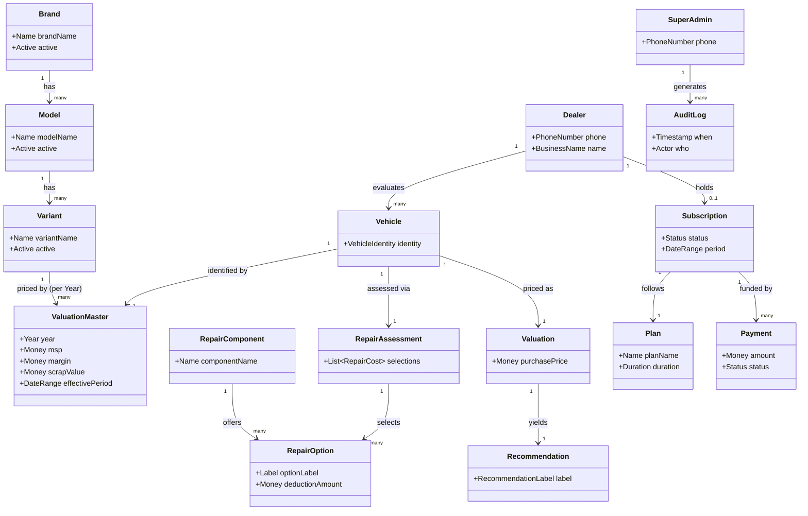
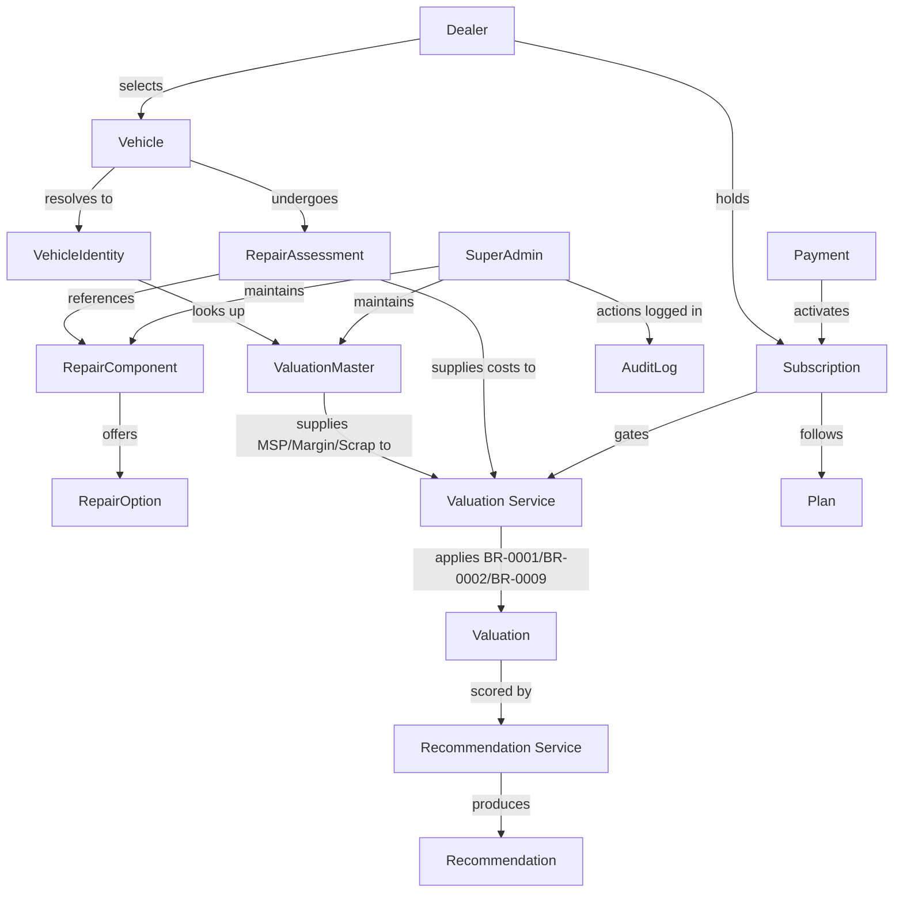
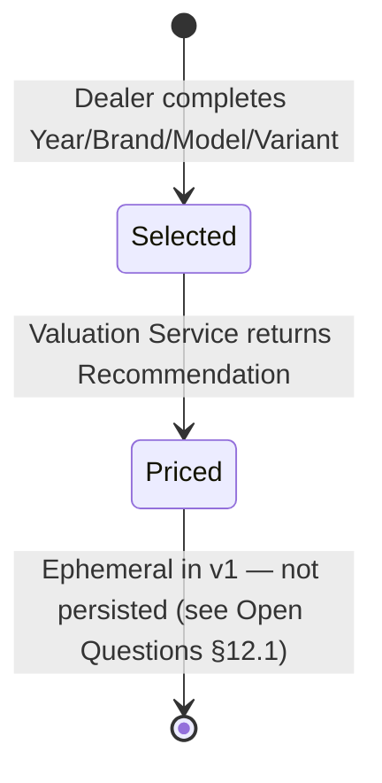
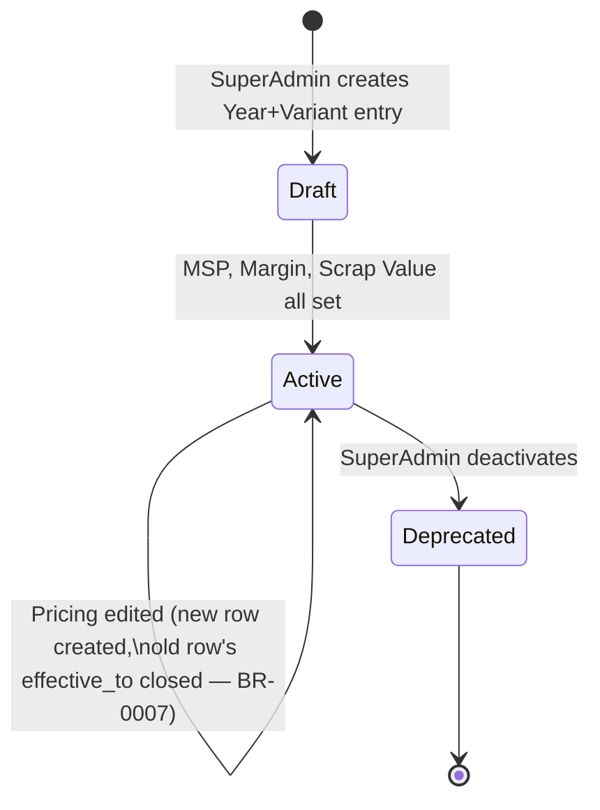
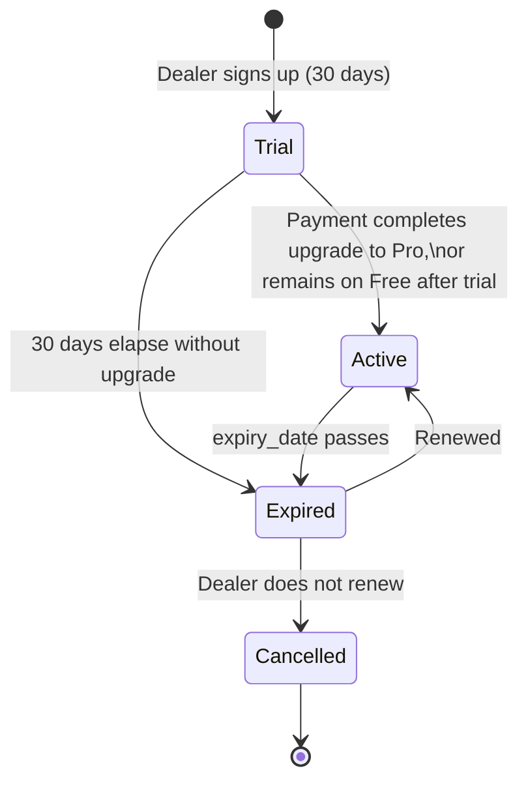
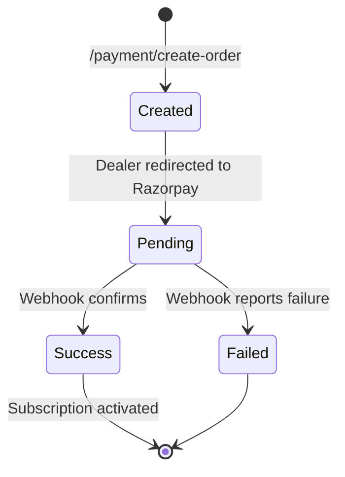
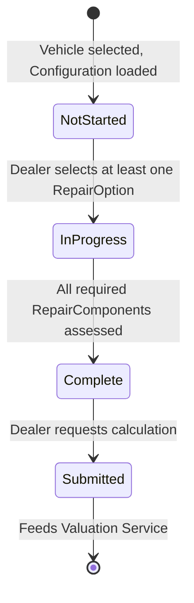

# DDD-001 — Canonical Domain Model

| Field | Value |
|---|---|
| Document ID | DDD-001 |
| Version | 1.1 |
| Status | Approved |
| Owner | Architecture AI |
| Reviewer | Human (architect) |
| Created | 2026-08-02 |
| Last Updated | 2026-08-02 |
| Related Documents | BRD-001, BRR-001, DBD-001, API-001, BDR-001, SDD-000, requirements-traceability-matrix.md, decision-traceability-matrix.md, AI-0005, ABL-001 |
| Next Documents | FS-001 (Vehicle Master), FS-002 (Valuation Engine) — both must conform to this model |

**v1.1 (ABL-001, 2026-08-02):** all 7 open questions in §12 are now
resolved via the Approved `AI-0005` decision batch — see each item
below. Status moves Needs Review → Approved.

This document is the **business language** of BIKEVALUATOR. It is not a
database schema (see DBD-001), not an API specification (see API-001),
and not implementation. It describes what the business *is*, in terms a
domain expert would recognize, independent of how it is stored or
transmitted.

---

## 1. Domain Philosophy

A domain model captures business *meaning* — the objects, rules, and
relationships that would still be true even if BIKEVALUATOR were
reimplemented on entirely different technology. It is deliberately one
level of abstraction above the artifacts other documents own:

| Layer | Owned By | Answers |
|---|---|---|
| Business Object | **This document (DDD-001)** | "What is a Dealer, conceptually, and what can it do?" |
| Database Table | DBD-001 | "How is a Dealer's data physically stored, indexed, and constrained?" |
| API DTO | API-001 | "What JSON shape crosses the wire when a client asks about a Dealer?" |
| Flutter Model | (future FS/implementation) | "What Dart class does the UI bind to?" |

A single business object (e.g. `ValuationMaster`) may correspond to one
database table, one row shape, and one Dart class — but the domain
object is defined independently of all three, and survives if any of
them change. Rules referenced here (`BR-000x`) come from BRR-001 and are
never restated, only cited.

---

## 2. Bounded Contexts

A bounded context is a boundary within which a term has one unambiguous
meaning. Contexts below correspond to BRD-001's module list and
DBD-001's table groupings, restated in business terms.

| Bounded Context | Owns (business concern) | Status |
|---|---|---|
| **Authentication** | Identity, login, session — who is acting | v1 |
| **Vehicle Master** | The catalog of what a vehicle *is* and what it's centrally priced at | v1 |
| **Repair Master** | The catalog of repair components and their fixed cost deductions | v1 |
| **Valuation Engine** | The act of turning a vehicle selection + repair assessment into a priced recommendation | v1 |
| **Subscription** | What tier of access a Dealer has, and for how long | v1 |
| **Payments** | Money changing hands to fund a Subscription | v1 |
| **Administration** | Super Admin's control over master data, and the audit trail of that control | v1 |
| **Reporting** | Turning past Valuations into dealer-facing summaries | v2 (disabled in v1 — `valuation_requests` not written to) |
| **Notifications** | Telling a Dealer something happened | Future |
| **Settings** | Platform-wide configuration not owned by any single feature | v1 (minimal) |
| **Analytics** | Aggregate insight across Dealers/Valuations | Future |
| **Future AI** | AI-assisted pricing suggestions, OCR, VIN lookup | Future (FS-000 §9) |

Vehicle Master and Repair Master are deliberately **separate contexts**,
not one nested inside the other — this mirrors BUS-0004's resolution of
BDR-0001 (they are sibling modules, both Super-Admin-owned).

---

## 3. Domain Objects

For each object: Purpose, Responsibilities, Business Owner (which
bounded context), Lifecycle (pointer to §10 where a diagram exists),
Dependencies, Future Extensions.

### Dealer
- **Purpose:** The B2B customer using the platform to price vehicles.
- **Responsibilities:** Initiates Valuations; holds a Subscription;
  cannot edit any pricing or catalog data.
- **Business Owner:** Authentication (identity), Subscription (tier).
- **Lifecycle:** Invited → Active → Suspended (SDD-000 §3); no dedicated
  diagram redrawn here, unchanged from SDD-000.
- **Dependencies:** Subscription (1:1 active tier at any time).
- **Future Extensions:** Multi-user per Dealer account, device
  management (BRD-001 §11).

### SuperAdmin
- **Purpose:** The sole role authorized to change business-critical
  master data.
- **Responsibilities:** Creates/edits Brand, Model, Variant,
  ValuationMaster, RepairComponent, RepairOption; manages Dealer
  accounts and Subscriptions.
- **Business Owner:** Administration.
- **Lifecycle:** Not modeled as a stateful entity — a permission level,
  not a workflow.
- **Dependencies:** None upstream; everything in Vehicle Master and
  Repair Master depends on SuperAdmin as the sole writer (BR-0004).
- **Future Extensions:** None indicated — BRD-001 §5 explicitly rejects
  a further "Admin" tier between Dealer and SuperAdmin.

### Vehicle
- **Purpose:** The specific used two-wheeler a Dealer is, at this
  moment, trying to price — a concrete instance, not a catalog entry.
- **Responsibilities:** Identifies which ValuationMaster row applies
  (via Year+Variant) and carries the RepairAssessment for this pricing
  attempt.
- **Business Owner:** Valuation Engine.
- **Lifecycle:** Selected → Priced (ephemeral in v1 — see §10 and Open
  Questions §12.1; no persisted table exists for it in DBD-001 v1).
- **Dependencies:** Variant (identity), RepairAssessment (condition).
- **Future Extensions:** Persisted Vehicle/Evaluation history once v2's
  `valuation_requests` is activated (BRD-001, DBD-001 §2).

### Brand
- **Purpose:** Manufacturer identity (e.g. Honda, Bajaj, TVS).
- **Responsibilities:** Roots the Model→Variant hierarchy.
- **Business Owner:** Vehicle Master.
- **Lifecycle:** Active/Inactive (`active` boolean, DBD-001 §5) + soft
  delete.
- **Dependencies:** None upstream.
- **Future Extensions:** None indicated.

### Model
- **Purpose:** A product line within a Brand (e.g. Honda Activa).
- **Responsibilities:** Roots the Variant list for a given Brand.
- **Business Owner:** Vehicle Master.
- **Lifecycle:** Active/Inactive + soft delete.
- **Dependencies:** Brand.
- **Future Extensions:** None indicated.

### Variant
- **Purpose:** A specific configuration of a Model (e.g. Activa 125
  Standard, Disc).
- **Responsibilities:** The unit that ValuationMaster prices, per Year.
- **Business Owner:** Vehicle Master.
- **Lifecycle:** Active/Inactive + soft delete.
- **Dependencies:** Model.
- **Future Extensions:** None indicated.

### ValuationMaster
- **Purpose:** The centrally-controlled pricing truth for a given
  Year+Variant — MSP, Margin, Scrap Value. This is the business's
  intellectual property (ADR-013, BRD-001 §1).
- **Responsibilities:** Supplies the inputs BR-0001/BR-0002 need; keeps
  a temporal history of pricing changes (BR-0007).
- **Business Owner:** Vehicle Master.
- **Lifecycle:** Draft → Active → Deprecated, with `effective_from`/
  `effective_to` chaining across pricing edits (§10; BR-0007).
- **Dependencies:** Variant, Year.
- **Future Extensions:** Per-dealer/region Margin override was
  considered and explicitly rejected for v1 (BDR-0002 resolution).

### RepairComponent
- **Purpose:** A named part of the vehicle whose condition affects
  price (Engine, Colour, Gearbox, Tyre, Plastic, Clutch).
- **Responsibilities:** Groups its RepairOptions.
- **Business Owner:** Repair Master.
- **Lifecycle:** Active/Inactive + soft delete.
- **Dependencies:** None upstream.
- **Future Extensions:** Battery, Chain Kit, Suspension, Lights,
  Accessories (FS-000 §3, DBD-001 §2).

### RepairOption
- **Purpose:** One selectable condition state for a RepairComponent
  (OK/Partial/Full), with a fixed ₹ deduction.
- **Responsibilities:** Supplies BR-0010's fixed-amount deduction.
- **Business Owner:** Repair Master.
- **Lifecycle:** Active/Inactive + soft delete.
- **Dependencies:** RepairComponent.
- **Future Extensions:** None indicated.

### RepairAssessment
- **Purpose:** The Dealer's actual condition selections (one
  RepairOption per RepairComponent) for a single Vehicle pricing
  attempt.
- **Responsibilities:** Feeds the Valuation Service's cost deduction
  step.
- **Business Owner:** Valuation Engine.
- **Lifecycle:** Not Started → In Progress → Complete → Submitted (§10);
  not persisted independently in v1 (transient within the
  `/valuation/calculate` request/response cycle — Open Question §12.3).
- **Dependencies:** RepairComponent/RepairOption (per selection).
- **Future Extensions:** Persisted per-Vehicle once v2's
  `valuation_requests` activates.

### Valuation
- **Purpose:** The business transaction of turning a Vehicle + its
  RepairAssessment into a priced outcome.
- **Responsibilities:** Orchestrates BR-0001, BR-0002, BR-0009; produces
  a Recommendation.
- **Business Owner:** Valuation Engine.
- **Lifecycle:** Requested → Calculated (§6 Domain Events); stateless/
  ephemeral in v1, per API-001's synchronous `/valuation/calculate`.
- **Dependencies:** Vehicle, ValuationMaster, RepairAssessment.
- **Future Extensions:** Persisted history, reporting (BRD-001, v2).

### Recommendation
- **Purpose:** The categorical buy signal (Excellent/Good/Average/Scrap
  labels; BR-0003) and the final rounded price (BR-0009).
- **Responsibilities:** The thing a Dealer actually reads.
- **Business Owner:** Valuation Engine.
- **Lifecycle:** Computed once per Valuation; immutable once produced.
- **Dependencies:** Valuation.
- **Future Extensions:** Exact numeric thresholds still open (BDR-0004).

### Subscription
- **Purpose:** What tier of platform access a Dealer currently has.
- **Responsibilities:** Gates whether a Dealer may start a new Valuation
  (BR-0006).
- **Business Owner:** Subscription.
- **Lifecycle:** Trial → Active → Expired → (Renewed→Active |
  Cancelled) (§10; SDD-000 §3).
- **Dependencies:** Dealer, Plan.
- **Future Extensions:** None indicated beyond existing Trial/Free/Pro
  model.

### Plan
- **Purpose:** The catalog of subscription tiers (Trial, Free, Pro) and
  what each entitles a Dealer to.
- **Responsibilities:** Defines duration, ad visibility, vehicle-catalog
  visibility limits.
- **Business Owner:** Subscription.
- **Lifecycle:** Active/Inactive (reference data, rarely changes).
- **Dependencies:** None upstream.
- **Future Extensions:** None indicated.

### Payment
- **Purpose:** A record of money moving to fund a Subscription.
- **Responsibilities:** Triggers Subscription activation on success
  (via webhook).
- **Business Owner:** Payments.
- **Lifecycle:** Created → Pending → Success/Failed (§10; BRD-001 §13's
  Razorpay flow).
- **Dependencies:** Subscription, Dealer.
- **Future Extensions:** UPI, Cards, Net Banking as separate gateway
  options (BRD-001 §13).

### AuditLog
- **Purpose:** The record of who changed what master data, when.
- **Responsibilities:** Captures SuperAdmin's writes to Vehicle
  Master/Repair Master/Subscription/Dealer data.
- **Business Owner:** Administration.
- **Lifecycle:** Append-only; never edited or deleted.
- **Dependencies:** SuperAdmin (actor), whichever object was changed.
- **Future Extensions:** None indicated.

### Notification
- **Purpose:** A message sent to a Dealer about something that
  happened.
- **Responsibilities:** Not yet built — reserved bounded context.
- **Business Owner:** Notifications.
- **Lifecycle:** Not modeled — future.
- **Dependencies:** Dealer, whichever event triggered it (§6).
- **Future Extensions:** Push/Email/SMS/WhatsApp (BRD-001, DBD-001 §2).

### SystemSetting
- **Purpose:** Platform-wide configuration not owned by any single
  feature (default scrap value, support number, app version,
  maintenance mode, privacy policy, terms, ad settings).
- **Responsibilities:** Read by multiple contexts; written only by
  SuperAdmin.
- **Business Owner:** Settings.
- **Lifecycle:** Key-value, no formal lifecycle.
- **Dependencies:** None upstream.
- **Future Extensions:** None indicated.

---

## 4. Aggregates

An aggregate is a consistency boundary — a cluster of objects that must
change together and that external code may only reference by the
root's identity.

| Aggregate Root | Contains | Why this is the boundary |
|---|---|---|
| **Brand** | Model, Variant (as child entities within the catalog hierarchy) | Deactivating/soft-deleting a Brand cascades meaning to its Models and Variants; the catalog hierarchy is edited as one unit by SuperAdmin via the same `/admin/vehicles` surface (API-001). *(This grouping is this document's inference — the source documents do not state an aggregate boundary explicitly; see Open Question §12.4.)* |
| **ValuationMaster** | — (references Variant by identity only, does not contain it) | Pricing has its own independent temporal lifecycle (BR-0007's `effective_from`/`effective_to` chaining) distinct from the catalog's active/inactive lifecycle — it must be able to version without touching Variant. |
| **RepairComponent** | RepairOption | A component's options are meaningless without their parent component and are always edited together (one component, its full option list, in one Admin action). |
| **Valuation** | Vehicle (identity reference), RepairAssessment, Recommendation | These only make sense together — a Valuation without its Vehicle selection or RepairAssessment is incomplete, and Recommendation cannot exist independently of the Valuation that produced it. This is the Valuation Engine's core transactional boundary. |
| **Subscription** | — (references Plan and Payment by identity, does not contain them) | Plan is shared reference data across all Dealers, not owned by one Subscription. Payment has its own external-system lifecycle (webhook-driven) and must be able to fail/retry independently of Subscription's state. |
| **Dealer** | — (references Subscription by identity) | A Dealer's identity is independent of which Subscription it currently holds; Subscriptions can be swapped without recreating the Dealer. |

`SuperAdmin`, `AuditLog`, `Notification`, and `SystemSetting` are not
modeled as aggregates with internal structure — they are either a role
(SuperAdmin), an append-only log (AuditLog), or simple reference/future
entities (Notification, SystemSetting).

---

## 5. Value Objects

Objects defined entirely by their attributes, with no identity of their
own — two instances with the same values are interchangeable.

| Value Object | Represents |
|---|---|
| **Money** | An amount in a specific Currency (used for MSP, Margin, Scrap Value, repair deduction amounts, Payment amount). |
| **Currency** | ₹ (INR) only in v1 — no multi-currency support (BDR-0014 resolution). |
| **PhoneNumber** | A 10-digit Indian mobile number, the primary Dealer identifier for OTP login. |
| **OTP** | A time-limited one-time code used to verify a PhoneNumber. |
| **JWT** | A signed, stateless session token issued after OTP verification. |
| **VehicleIdentity** | The composite (Year, Brand, Model, Variant) key that uniquely locates a ValuationMaster row. |
| **RepairCost** | The pairing of a RepairOption with its fixed Money deduction. |
| **RecommendationLabel** | One of Excellent/Good/Average/Scrap (BR-0003) — exact thresholds still open (BDR-0004). |
| **Percentage** | Used internally to compute the RecommendationLabel band (Purchase Price ÷ MSP). |
| **DateRange** | An `effective_from`/`effective_to` pair used for ValuationMaster's temporal versioning (BR-0007). |
| **UUID** | The identifier type for every entity (ADR-010) — a Value Object in the sense that it carries no business meaning beyond uniqueness. |

---

## 6. Domain Events

Named things that happen in the business, independent of how they are
implemented (queue, webhook, direct call).

| Event | Triggered By | Consumed By |
|---|---|---|
| **Vehicle Selected** | Dealer completes Year→Brand→Model→Variant selection | Valuation Engine (loads Configuration) |
| **Configuration Loaded** | Vehicle Master returns MSP/Margin/Scrap/repair options for a VehicleIdentity | Flutter client (Repair Assessment screen) |
| **Repair Updated** | Dealer changes a RepairAssessment selection | (client-local state; not yet a server event in v1) |
| **Calculation Requested** | Dealer submits a completed RepairAssessment | Valuation Service |
| **Calculation Completed** | Valuation Service produces a Recommendation | Flutter client, (future) Reporting |
| **Vehicle Master Updated** | SuperAdmin edits Brand/Model/Variant/ValuationMaster | AuditLog, (future) cache invalidation |
| **Repair Cost Updated** | SuperAdmin edits a RepairOption's deduction amount | AuditLog |
| **OTP Requested** | Dealer enters a PhoneNumber | Authentication Service |
| **OTP Verified** | Dealer submits a correct OTP | Authentication Service (issues JWT) |
| **Subscription Activated** | Trial starts, or a Payment succeeds | Dealer's access level |
| **Subscription Expired** | Subscription's `expiry_date` passes | Valuation Engine (blocks new Valuations, BR-0006) |
| **Payment Completed** | Razorpay webhook confirms success | Subscription (activation) |
| **Notification Sent** | Any of the above events, once Notifications is built | Dealer (future) |

---

## 7. Domain Services

Stateless operations that don't naturally belong to a single object.

| Service | Responsibility |
|---|---|
| **Authentication Service** | OTP issuance/verification, JWT issuance and validation. |
| **Pricing Service** | Resolves a VehicleIdentity + RepairAssessment into the raw inputs (MSP, Margin, Scrap Value, per-component RepairCost) needed for calculation — reads from Vehicle Master and Repair Master, writes nothing. |
| **Valuation Service** | Orchestrates the full pricing transaction: calls Pricing Service, applies BR-0001 (Purchase Price formula), BR-0002 (Scrap floor), BR-0009 (rounding), and hands off to Recommendation Service. |
| **Recommendation Service** | Applies BR-0003/BR-0008 (centralized bands) to a computed Purchase Price to produce a RecommendationLabel. |
| **Subscription Service** | Tracks Trial/Free/Pro state transitions, expiry checks (BR-0006). |
| **Payment Service** | Orchestrates Razorpay order creation, verification, and webhook handling; triggers Subscription Service on success. |
| **Reporting Service** | (v2, not active) Turns persisted Valuation history into dealer-facing summaries. |

---

## 8. Relationships

### 8.1 Structural (Business) Class Diagram

### 8.2 Business Relationship Flow (not database ER notation)

---

## 9. Business Constraints

Every constraint is cited by `BR-000x` from BRR-001; none are restated
in full here.

- **One ValuationMaster per Year+Variant.** *(Not yet a numbered BR —
  currently enforced only as a DB uniqueness constraint per DBD-001 §2
  / IPS-001's E-CATALOG-001. Flagged in Open Questions §12.6 as a
  candidate for a formal BR-0011.)*
- **Dealer cannot edit pricing or catalog data** — BR-0004.
- **Only SuperAdmin edits master data** (Vehicle Master, Repair Master,
  Subscription plans) — BR-0004.
- **Repair costs are fixed amounts, never percentages** — BR-0010.
- **Purchase Price = MSP − Margin − Repair Cost** — BR-0001.
- **Scrap Rule:** if the computed result is below Scrap Value, the
  floor applies — BR-0002.
- **Rounding:** final price rounds to the nearest ₹10 — BR-0009.
- **Recommendation bands are centrally defined**, never hardcoded per
  screen/module — BR-0008 (exact thresholds still provisional, BR-0003).
- **Subscription Rule:** an expired Subscription blocks new Valuations;
  existing ones remain viewable — BR-0006.
- **ValuationMaster pricing changes are versioned**, not overwritten —
  BR-0007.

---

## 10. Lifecycle Diagrams

### Vehicle

### ValuationMaster

### Subscription

### Payment

### RepairAssessment

---

## 11. Traceability Matrix

Domain Object → Related BR IDs → DB Table(s) (DBD-001) → API Endpoint(s)
(API-001).

| Domain Object | BR IDs | DB Table(s) | API Endpoint(s) |
|---|---|---|---|
| Dealer | BR-0004 (cannot edit pricing) | `users` | `/profile`, `/auth/*` |
| SuperAdmin | BR-0004 | `users` (`role` column, resolved §12.2 via `SEC-0001`) | `/admin/*` |
| Vehicle | — | *(none in v1 — ephemeral, resolved §12.1 via `ARC-0008`)* | `/vehicles/configuration` |
| Brand | — | `brands` | `/vehicles/brands`, `/admin/vehicles` |
| Model | — | `models` | `/vehicles/models`, `/admin/vehicles` |
| Variant | — | `variants` | `/vehicles/variants`, `/admin/vehicles` |
| ValuationMaster | BR-0001, BR-0002, BR-0007 | `valuation_master` | `/vehicles/configuration`, `/admin/valuation-master` |
| RepairComponent | BR-0010 | `repair_components` | `/repairs/components`, `/admin/repair-components` |
| RepairOption | BR-0010 | `repair_options` | `/repairs/components`, `/admin/repair-components` |
| RepairAssessment | BR-0010 | *(none in v1 — transient, resolved §12.3 via `ARC-0009`)* | `/valuation/calculate` (request payload) |
| Valuation | BR-0001, BR-0002, BR-0009 | `valuation_requests` (v2, inactive in v1) | `/valuation/calculate` |
| Recommendation | BR-0003, BR-0008 | `valuation_requests` (v2, inactive in v1) | `/valuation/calculate` (response) |
| Subscription | BR-0006 | `subscriptions` | `/subscription/current`, `/subscription/upgrade` |
| Plan | — | `plans` | `/subscription/plans` |
| Payment | — | `payments` | `/payment/create-order`, `/payment/verify`, `/payment/webhook` |
| AuditLog | — | (audit logs table, DBD-001 §2) | *(not yet an endpoint — internal only)* |
| Notification | — | *(none yet — future)* | *(none yet — future)* |
| SystemSetting | — | (system settings table, DBD-001 §2) | *(not yet an endpoint)* |

---

## 12. Open Questions — Resolved (ABL-001, 2026-08-02)

All 7 items below were open at authoring time; each is now resolved via
the Approved `AI-0005` decision batch. Kept here (rather than deleted)
as the traceable record of what was asked and how it was answered.

1. **Vehicle persistence** — **Resolved (`ARC-0008`):** ephemeral only
   in v1, no persisted table. Confirmed in DBD-001 §2.
2. **Role storage** — **Resolved (`SEC-0001`):** a `role` column
   (`dealer` | `super_admin`) was added to DBD-001's `users` table.
3. **RepairAssessment persistence** — **Resolved (`ARC-0009`):**
   transient only, submitted directly in the `/valuation/calculate`
   request payload, never stored independently.
4. **Aggregate boundary for the catalog hierarchy** — **Resolved
   (`ARC-0010`):** Brand accepted as the aggregate root over
   Model/Variant, as originally documented here.
5. **Exact recommendation thresholds** (BR-0003) — **Resolved
   (`BUS-0005`):** confirmed 90/75/60% as final. See BRR-001 v1.2.
6. **"One ValuationMaster per Year+Variant"** — **Resolved
   (`BUS-0006`):** formalized as `BR-0011` in BRR-001 v1.2.
7. **Notification / Analytics / Future AI domain objects** —
   **Resolved (`OPS-0001`):** deferred, no action needed until those
   bounded contexts are actually scoped — an explicit decision to wait,
   not an unanswered question.
