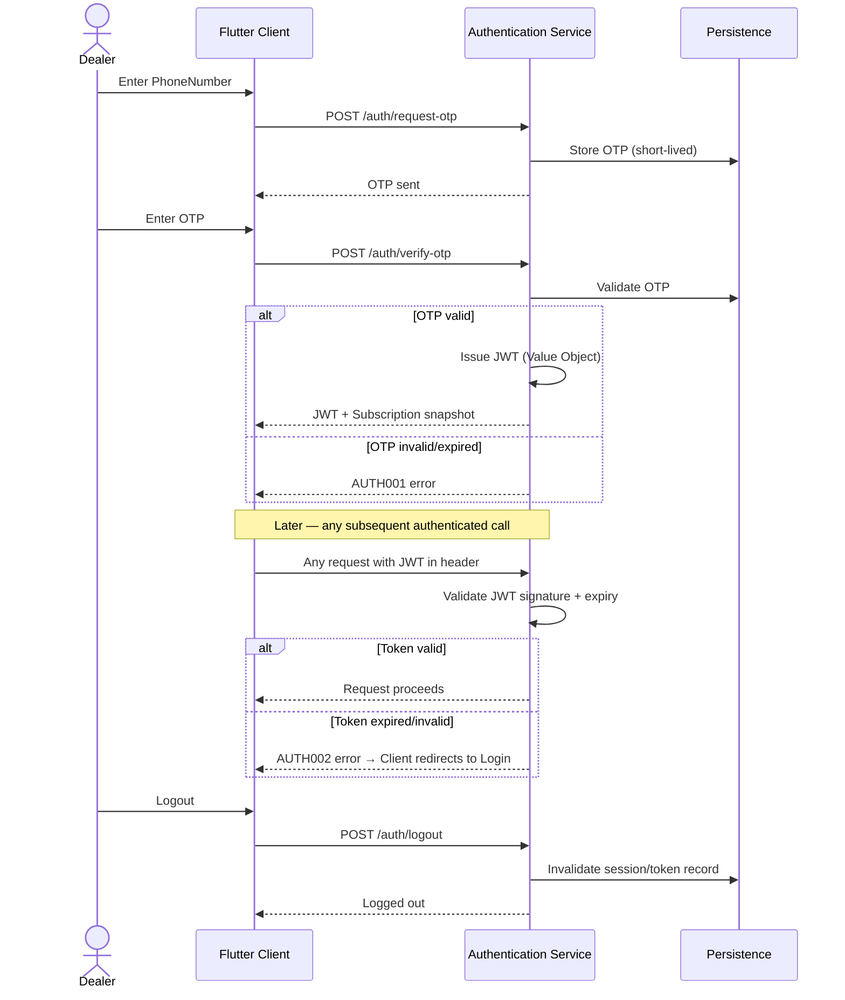
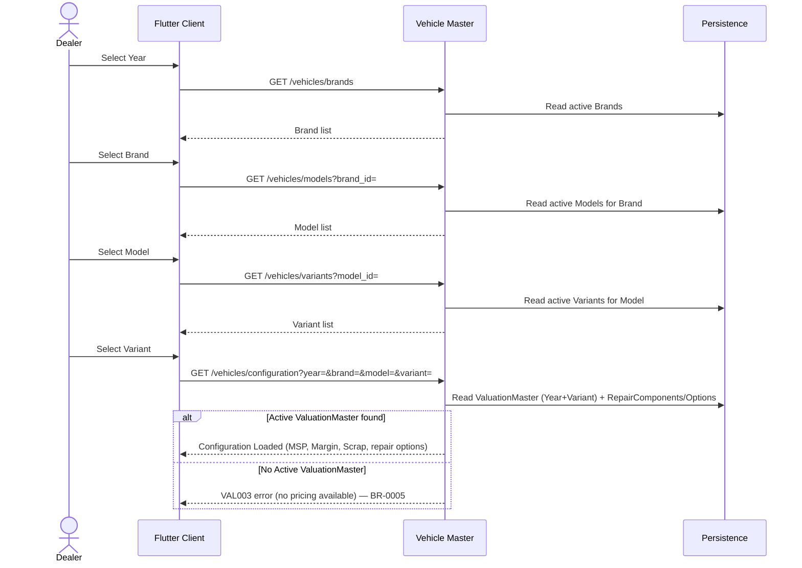
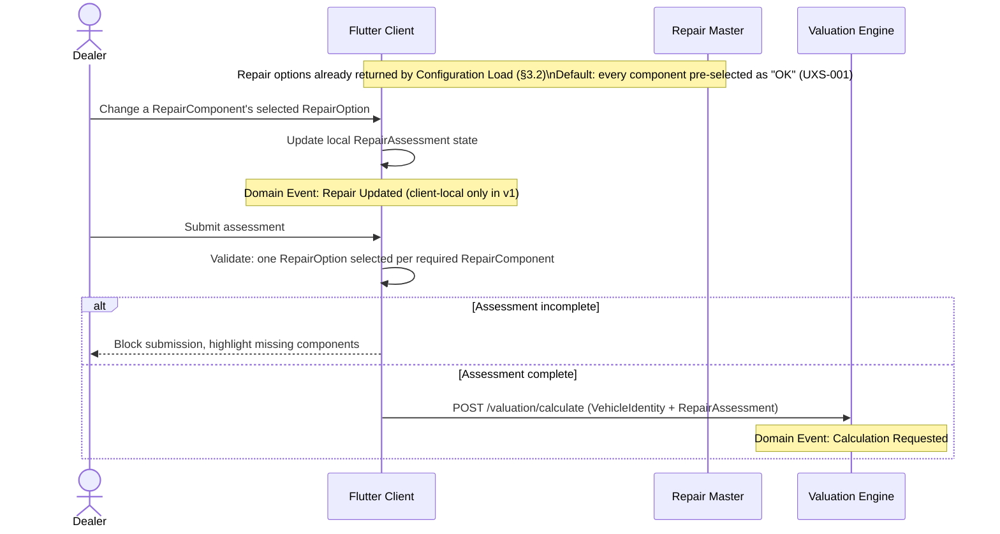
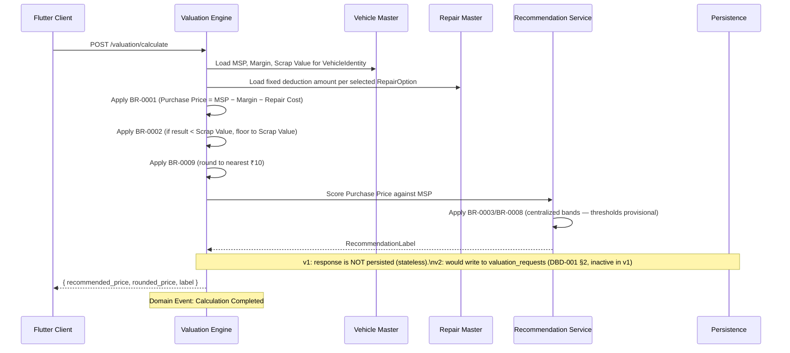
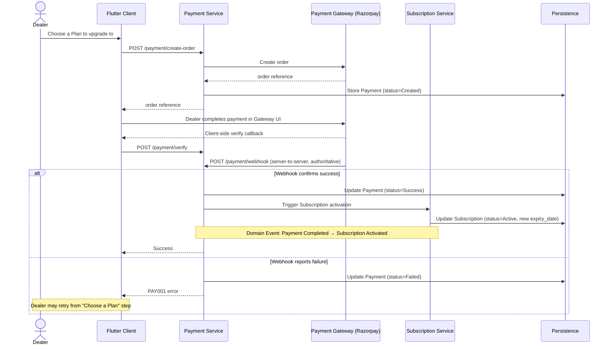
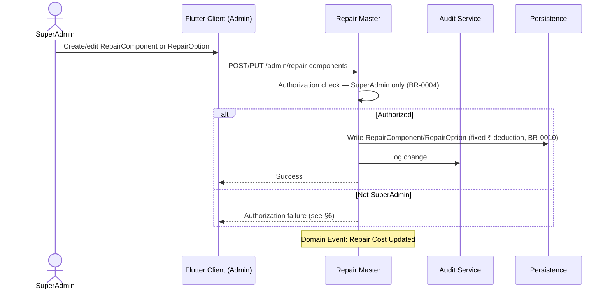

# SSD-001 — Canonical System Sequence Diagrams

| Field | Value |
|---|---|
| Document ID | SSD-001 |
| Version | 1.1 |
| Status | Approved |
| Owner | Architecture AI |
| Reviewer | Human (architect) |
| Created | 2026-08-02 |
| Last Updated | 2026-08-02 |
| Related Documents | DDD-001, BRD-001, DBD-001, API-001, BRR-001, BDR-001, AI-0005, ABL-001 |
| Next Documents | FS-001 through FS-006 — each must conform to the relevant flow(s) here |

**v1.1 (ABL-001, 2026-08-02):** 8 of §9's 9 open questions are now
resolved via the Approved `AI-0005` decision batch (item 4, payment
reconciliation, remains open — see §9). Status moves Needs Review →
Approved.

This document is the **behavioral architecture** of BIKEVALUATOR: the
sequence of interactions between actors, UI, backend services, domain
services, and persistence, for every major business flow. It contains
no implementation code, no SQL, no REST payload bodies, and no UI
mockups.

---

## 1. Purpose

Four architecture documents each answer a different question about the
same system:

| Document | Answers |
|---|---|
| **DDD-001** (Domain Model) | "What objects exist, and how do they relate to each other, at rest?" |
| **DBD-001** (Database Design) | "How is that data physically stored?" |
| **API-001** (API Design) | "What request/response shape crosses the wire for a single call?" |
| **SSD-001** (this document) | "In what *order* do calls, checks, and state changes happen across a whole business flow, and who talks to whom?" |
| **FS-00x** (future, per module) | "Given all of the above, exactly what must be built?" |

A Functional Specification (FS) cannot be written correctly without
SSD-001, because DDD-001/DBD-001/API-001 describe static shape, not the
order of operations, failure points, or which actor is authoritative at
each step.

---

## 2. Actors

| Actor | Responsibility |
|---|---|
| **Dealer** | Initiates Authentication, Vehicle Selection, Repair Assessment, Valuation, Subscription upgrade, Payment. |
| **Super Admin** | Initiates Vehicle Master Administration and Repair Master Administration flows. |
| **Flutter Client** | Mediates every Dealer/Super Admin action; holds only client-local state (current form input); never computes business rules itself (ADR-005, ADR-014). |
| **Authentication Service** | Issues/validates OTP and JWT (DDD-001 §7). |
| **Vehicle Master** | Owns Brand/Model/Variant/ValuationMaster; the source of Configuration Load responses. |
| **Repair Master** | Owns RepairComponent/RepairOption; the source of repair-cost data. |
| **Valuation Engine (Valuation Service + Pricing Service)** | Orchestrates BR-0001/BR-0002/BR-0009 to turn a Vehicle + RepairAssessment into a priced Valuation. |
| **Recommendation Service** | Applies BR-0003/BR-0008 to a computed price to produce a RecommendationLabel. |
| **Subscription Service** | Tracks Trial/Free/Pro state, expiry, and gates Valuation access (BR-0006). |
| **Payment Gateway (Razorpay, external)** | Processes the actual money movement; sends a webhook back to BIKEVALUATOR. |
| **Payment Service** | Internal orchestrator between BIKEVALUATOR and the Payment Gateway; triggers Subscription activation. |
| **Notification Service** | Future — not active in v1 (DDD-001 §2). Included here as a placeholder participant only. |
| **Audit Service** | Records who changed what master data, when (AuditLog, DDD-001 §3). |
| **Persistence** | Generic stand-in for "the database," used in diagrams only to show *that* a read/write happens — no schema shown (see DBD-001 for that). |

---

## 3. System Flows

Each diagram below cites the `BR-000x` rules and DDD-001 objects it
touches; no business rule text is restated.

### 3.1 Authentication — OTP Login, Token Generation, Session Validation, Logout



*Touches:* Authentication Service (DDD-001 §7); `OTP`, `JWT`, `PhoneNumber` value objects (DDD-001 §5); no BR references (auth has no numbered business rule in BRR-001 — flagged in §9).

### 3.2 Vehicle Selection — Year → Brand → Model → Variant → Configuration Load



*Touches:* Brand, Model, Variant, ValuationMaster (DDD-001 §3); Domain Event *Vehicle Selected* → *Configuration Loaded* (DDD-001 §6); BR-0005.

### 3.3 Repair Assessment — Load Components, Select Conditions, Validation, Calculation Request



*Touches:* RepairComponent, RepairOption, RepairAssessment (DDD-001 §3); BR-0010 (fixed deductions, resolved server-side in §3.4, not here); RepairAssessment lifecycle NotStarted→InProgress→Complete→Submitted (DDD-001 §10).

### 3.4 Valuation — Configuration Retrieval → Rules → Recommendation → Response



*Touches:* ValuationMaster, RepairAssessment, Valuation, Recommendation
(DDD-001 §3); Pricing Service, Valuation Service, Recommendation Service
(DDD-001 §7); BR-0001, BR-0002, BR-0003, BR-0008, BR-0009, BR-0010.

### 3.5 Subscription Validation — Trial / Free / Pro / Expired / Upgrade / Ads / Access Control

```mermaid
sequenceDiagram
    actor Dealer
    participant Client as Flutter Client
    participant Sub as Subscription Service
    participant VE as Valuation Engine
    participant P as Persistence

    Dealer->>Client: Attempt to start a new Valuation
    Client->>Sub: Check current Subscription status
    Sub->>P: Read Subscription (status, expiry_date)
    alt status = Trial or Pro, not expired
        Sub-->>Client: Access granted, no ads
        Client->>VE: Proceed with §3.2–§3.4
    else status = Free
        Sub-->>Client: Access granted (limited vehicle DB), ads enabled
        Client->>VE: Proceed with §3.2–§3.4 (catalog visibility limited)
    else status = Expired
        Sub-->>Client: SUB001 error — BR-0006
        Client-->>Dealer: Block new Valuation; existing history remains read-only viewable
    end

    Dealer->>Client: Request upgrade
    Client->>Sub: POST /subscription/upgrade
    Sub-->>Client: Redirect to §3.6 (Payment)
```

*Touches:* Subscription, Plan (DDD-001 §3); Subscription Service
(DDD-001 §7); BR-0006; Domain Event *Subscription Expired*.

### 3.6 Payment — Order Creation → Gateway → Webhook → Activation → Failure/Retry



*Touches:* Payment, Subscription (DDD-001 §3); Payment Service,
Subscription Service (DDD-001 §7); Domain Events *Payment Completed*,
*Subscription Activated*. The webhook, not the client-side verify call,
is treated as authoritative (see §5).

### 3.7 Vehicle Master Administration — Brand/Model/Variant Creation, ValuationMaster Versioning, Audit

```mermaid
sequenceDiagram
    actor SuperAdmin
    participant Client as Flutter Client (Admin)
    participant VM as Vehicle Master
    participant Audit as Audit Service
    participant P as Persistence

    SuperAdmin->>Client: Create/edit Brand, Model, or Variant
    Client->>VM: POST/PUT /admin/vehicles
    VM->>VM: Authorization check — SuperAdmin only (BR-0004)
    alt Authorized
        VM->>P: Write Brand/Model/Variant
        VM->>Audit: Log change (who, when, old/new value)
        VM-->>Client: Success
    else Not SuperAdmin
        VM-->>Client: Authorization failure (see §6)
    end

    SuperAdmin->>Client: Edit MSP/Margin/Scrap Value for a Year+Variant
    Client->>VM: PUT /admin/valuation-master
    VM->>VM: Authorization check (BR-0004)
    VM->>P: Close current row's effective_to; insert new row with new values (BR-0007 versioning)
    VM->>Audit: Log pricing change
    VM-->>Client: Success
    Note over VM: Domain Event: Vehicle Master Updated
```

*Touches:* Brand, Model, Variant, ValuationMaster, AuditLog (DDD-001
§3); BR-0004, BR-0007.

### 3.8 Repair Master Administration — Component, Options, Price Updates, Audit



*Touches:* RepairComponent, RepairOption, AuditLog (DDD-001 §3);
BR-0004, BR-0010.

---

## 4. Business Events

Reference: DDD-001 §6 (Domain Events). Restated here with
Trigger/Producer/Consumer/Result, not redefined.

| Event | Trigger | Producer | Consumer | Result |
|---|---|---|---|---|
| Vehicle Selected | Dealer completes §3.2 | Vehicle Master | Valuation Engine | Configuration Load begins |
| Configuration Loaded | Vehicle Master returns pricing+repair options | Vehicle Master | Flutter Client | Repair Assessment screen populated |
| Repair Updated | Dealer changes a RepairAssessment selection | Flutter Client | (client-local only, v1) | Local state updated |
| Calculation Requested | Dealer submits a complete RepairAssessment | Flutter Client | Valuation Engine | §3.4 begins |
| Calculation Completed | Valuation Engine produces a Recommendation | Valuation Engine | Flutter Client, (future) Reporting | Result displayed |
| Vehicle Master Updated | SuperAdmin edits catalog/pricing | Vehicle Master | Audit Service | AuditLog entry |
| Repair Cost Updated | SuperAdmin edits a RepairOption | Repair Master | Audit Service | AuditLog entry |
| OTP Requested | Dealer enters PhoneNumber | Authentication Service | Dealer (via SMS, external) | OTP delivered |
| OTP Verified | Dealer submits correct OTP | Authentication Service | Flutter Client | JWT issued |
| Subscription Activated | Trial starts, or Payment succeeds | Subscription Service | Dealer's access level | Access unlocked |
| Subscription Expired | `expiry_date` passes | Subscription Service | Valuation Engine | New Valuations blocked (BR-0006) |
| Payment Completed | Gateway webhook confirms | Payment Service | Subscription Service | Subscription Activated event fires |
| Notification Sent | Any of the above (future) | Notification Service | Dealer | *(not active in v1)* |

---

## 5. State Synchronization

| Layer | What it holds | Authoritative? |
|---|---|---|
| **Client State** (Flutter) | In-progress Vehicle selection, in-progress RepairAssessment, cached Configuration Load response, JWT. | **No** — always disposable; the client never holds the only copy of anything business-critical. Lost on app restart except JWT (persisted locally) and whatever the server round-trips. |
| **Server State** (Vehicle Master / Repair Master / Subscription / Payment / Valuation Engine, in-memory per-request) | The request/response cycle's working data — e.g. the MSP/Margin/Scrap/repair-costs loaded during a single `/valuation/calculate` call. | **No** — transient; exists only for the duration of one request. |
| **Persistence** (Postgres, per DBD-001) | Brand/Model/Variant/ValuationMaster, RepairComponent/RepairOption, Subscription, Payment, AuditLog, SystemSetting. | **Yes** — the single source of truth for everything except an in-flight, not-yet-submitted RepairAssessment (which is genuinely ephemeral in v1 — see DDD-001 §12.1/§12.3). |
| **Payment Gateway** (Razorpay, external) | The actual money-movement record. | **Yes, for payment success/failure** — BIKEVALUATOR's own `Payment` row is a *mirror* of the Gateway's authoritative state, updated via webhook (§3.6). The client-side verify call is a UX signal only, never trusted for activation. |

**Rule of thumb:** Persistence is authoritative for everything durable;
the Payment Gateway is authoritative for payment success/failure
specifically; the client is never authoritative for anything.

---

## 6. Failure Scenarios

| Flow | Validation Failure | Authorization Failure | Business Rule Failure | Concurrency | Network Failure | Retry Strategy |
|---|---|---|---|---|---|---|
| Authentication | Malformed PhoneNumber/OTP → 400 | N/A (pre-auth) | N/A | N/A | Client shows "check connection," no auto-retry of OTP send (avoid duplicate SMS) | Dealer manually taps "Resend OTP" |
| Vehicle Selection | Invalid brand/model/variant id → VAL001/VAL002 | N/A (read-only, any authenticated Dealer) | No Active ValuationMaster → VAL003/BR-0005 | Two Dealers reading the same catalog concurrently — read-only, no conflict | Client retries the failed GET automatically | Idempotent GET — safe to retry indefinitely |
| Repair Assessment | Incomplete assessment blocked client-side (§3.3) | N/A | N/A | N/A (client-local state only in v1) | Client caches unsaved selections locally (per FS-000 §12 E-NET-001) | Resume from cached local state once connectivity returns |
| Valuation | N/A (server-validated inputs from prior steps) | N/A | Missing/expired ValuationMaster mid-calculation — open question, see §9 | Concurrent pricing edit *during* a calculation — open question, see §9 | Client retries `/valuation/calculate` | **Not yet defined whether this call is idempotent** — see §9 |
| Subscription Validation | N/A | N/A | Expired subscription → SUB001/BR-0006 | Subscription expiring mid-session — open question, see §9 | Client falls back to last-known subscription status; blocks on next server contact | Re-check on next authenticated call |
| Payment | Invalid order reference → 400 | N/A | N/A | Duplicate webhook delivery — open question, see §9 (idempotency) | Webhook delivery failure — Gateway's own retry policy (external, not BIKEVALUATOR's) | Gateway-side retry (external); BIKEVALUATOR should reconcile via periodic status poll — not yet defined, see §9 |
| Vehicle Master Admin | Invalid field values → 400 | Non-SuperAdmin → 403 (mechanism depends on DDD-001 §12.2's open question) | Duplicate Year+Variant → E-CATALOG-001 | Two SuperAdmins editing the same ValuationMaster simultaneously — open question, see §9 | Client retries the write | **Not safely retryable without an idempotency key** — see §9 |
| Repair Master Admin | Invalid field values → 400 | Non-SuperAdmin → 403 | N/A | Two SuperAdmins editing the same RepairOption simultaneously — open question, see §9 | Client retries the write | Same as above — see §9 |

---

## 7. Cross-Cutting Concerns

| Concern | Policy (per existing standards, not re-specified here) |
|---|---|
| **Logging** | Per LOG-001 — structured, leveled (Debug/Info/Warning/Error/Audit); every flow above that touches master data or money uses the `AUDIT` level. |
| **Auditing** | Every Vehicle Master Administration (§3.7) and Repair Master Administration (§3.8) write produces an AuditLog entry — no exceptions. |
| **Security** | Per SEC-001 — authorization enforced server-side on every Admin endpoint, never trusting client-side role display. |
| **Authorization** | BR-0004 (SuperAdmin-only writes) is checked at the API boundary for every Administration flow (§3.7, §3.8) via `users.role` + `E-AUTHZ-001` — resolved §9.5 (`SEC-0001`, `ARC-0006`). |
| **Transactions** | ValuationMaster versioning (§3.7) and its AuditLog write are one atomic transaction — resolved §9.6 (`ENG-0003`). |
| **Idempotency** | `/valuation/calculate` needs no idempotency key (stateless) — resolved §9.1 (`ENG-0002`). Payment webhook dedup by `transaction_id` — resolved §9.3 (`SEC-0002`); lost-webhook reconciliation remains open §9.4, deferred to FS-006. |
| **Caching** | Future — Vehicle Master catalog (Brand/Model/Variant lists) is a candidate for read-through caching once traffic justifies it; not designed here. |
| **Monitoring** | Future — no monitoring/alerting strategy defined yet for any flow above. |

---

## 8. Domain Policy Placeholders

Named, not implemented — future extension points where a flow's
decision logic could be made pluggable/configurable rather than fixed
in code.

- **PricingPolicy** — would govern how BR-0001's inputs are resolved
  (e.g. if per-dealer/regional Margin is ever introduced, contrary to
  the current global-Margin decision, BDR-0002). Referenced in §3.4.
- **RecommendationPolicy** — would govern BR-0003/BR-0008's banding
  logic, particularly once exact thresholds are confirmed (BDR-0004) or
  made Admin-configurable. Referenced in §3.4.
- **ScrapPolicy** — would govern BR-0002's floor behavior, in case
  Scrap Value derivation ever changes (BDR-0003 currently resolved as
  independently maintained, not derived). Referenced in §3.4.
- **AuthorizationPolicy** — would govern BR-0004's SuperAdmin-only
  check; the underlying question (how role is stored) is now resolved
  (`SEC-0001`, DDD-001 §12.2) — a `users.role` column. Referenced in
  §3.7, §3.8.
- **SubscriptionPolicy** — would govern BR-0006's access-gating logic
  across Trial/Free/Pro/Expired states. Referenced in §3.5.

These are placeholders for future extensibility only — v1 implements
each rule directly, per BRR-001, with no pluggable policy layer.

---

## 9. Open Questions

Genuinely undefined behavior at authoring time — not invented, not
silently resolved. **Updated (ABL-001, 2026-08-02):** 8 of 9 are now
resolved via the Approved `AI-0005` decision batch; kept here as the
traceable record.

1. **Valuation Engine idempotency** — **Resolved (`ENG-0002`):** no
   idempotency key needed; `/valuation/calculate` is stateless in v1
   (no writes), naturally safe to retry. See API-001.
2. **Concurrent master-data edits** — **Resolved (`ENG-0003`):**
   optimistic concurrency via an `updated_at` check; conflicting writes
   receive 409. See DBD-001 §6a.
3. **Payment webhook idempotency** — **Resolved (`SEC-0002`):** dedupe
   by gateway `transaction_id` (unique constraint, DBD-001 Payments);
   adopted now, detailed design still deferred to FS-006.
4. **Payment reconciliation** — **Still open.** `SEC-0002` covers
   duplicate-delivery dedup, not lost-delivery reconciliation/polling.
   Explicitly deferred to FS-006's detailed design, not resolved by
   `AI-0005`.
5. **Authorization mechanism** — **Resolved (`SEC-0001`, `ARC-0006`):**
   `users.role` column (DBD-001) + `E-AUTHZ-001` (SDD-000 §8) together
   define both the data model and the error contract.
6. **Transactionality of versioned writes** — **Resolved (`ENG-0003`,**
   same decision as item 2): ValuationMaster's `effective_to` close +
   new-row insert + AuditLog write are one atomic transaction. See
   DBD-001 §6a.
7. **Mid-flight expiry** — **Resolved (`BUS-0007`):** an in-flight
   Valuation is honored; Subscription expiry is checked only at flow
   start, not re-checked mid-flow.
8. **OTP resend/rate-limiting** — **Resolved (`SEC-0003`):** principle
   adopted now (max 3 resends/hour); detailed throttling design deferred
   to FS-003. See API-001 `/auth/request-otp`.
9. **Session/token refresh** — **Resolved (`ENG-0004`):** full re-auth
   on JWT expiry; no refresh-token flow in v1. See API-001 Authentication.

No conflicts between source documents were found beyond those already
tracked in DDD-001 §12 and BDR-001 — this document's conflicts are all
*gaps* (undefined behavior), not contradictions between two documents
that disagree.

---

## 10. Traceability

| Flow (§3.x) | BR IDs | DDD-001 Objects | API-001 Endpoint(s) | Future FS Module |
|---|---|---|---|---|
| 3.1 Authentication | — (no numbered BR) | (Value Objects: OTP, JWT, PhoneNumber) | `/auth/request-otp`, `/auth/verify-otp`, `/auth/logout` | FS-003 Authentication |
| 3.2 Vehicle Selection | BR-0005 | Brand, Model, Variant, ValuationMaster | `/vehicles/brands`, `/vehicles/models`, `/vehicles/variants`, `/vehicles/configuration` | FS-001 Vehicle Master |
| 3.3 Repair Assessment | BR-0010 | RepairComponent, RepairOption, RepairAssessment | (client-local; feeds `/valuation/calculate`) | FS-002 Valuation Engine |
| 3.4 Valuation | BR-0001, BR-0002, BR-0003, BR-0008, BR-0009, BR-0010 | ValuationMaster, RepairAssessment, Valuation, Recommendation | `/valuation/calculate` | FS-002 Valuation Engine |
| 3.5 Subscription Validation | BR-0006 | Subscription, Plan | `/subscription/current`, `/subscription/plans`, `/subscription/upgrade` | FS-005 Subscription |
| 3.6 Payment | — (no numbered BR) | Payment, Subscription | `/payment/create-order`, `/payment/verify`, `/payment/webhook` | FS-006 Payments |
| 3.7 Vehicle Master Admin | BR-0004, BR-0007 | Brand, Model, Variant, ValuationMaster, AuditLog | `/admin/vehicles`, `/admin/valuation-master` | FS-001 Vehicle Master, FS-004 Admin |
| 3.8 Repair Master Admin | BR-0004, BR-0010 | RepairComponent, RepairOption, AuditLog | `/admin/repair-components` | FS-004 Admin |
